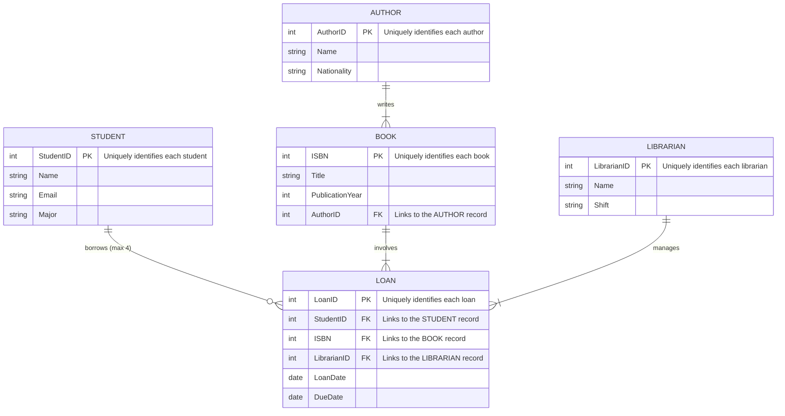
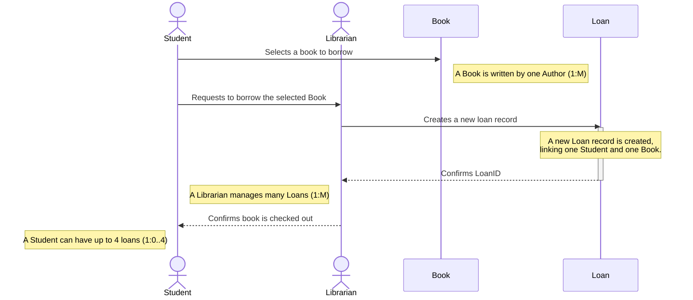
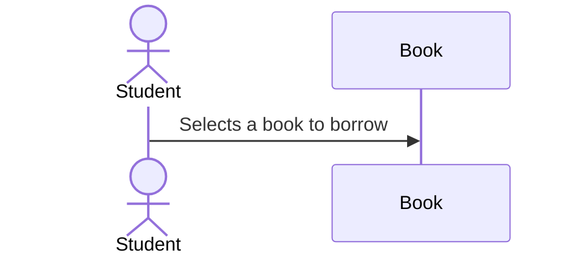
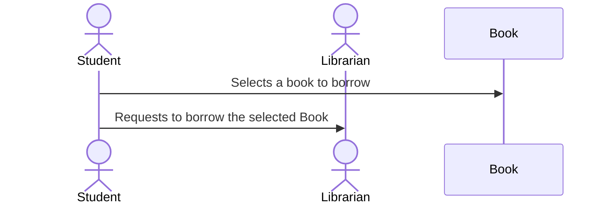
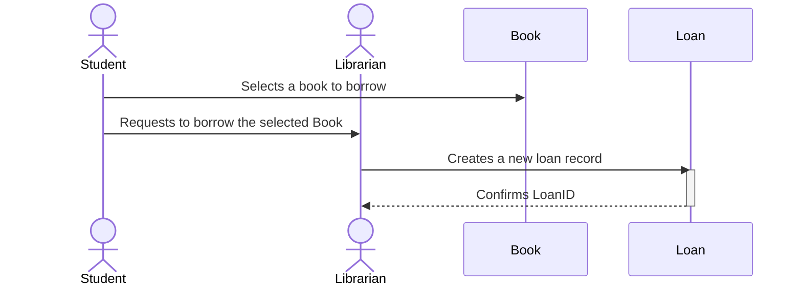

# 
School Library Database

<h1>School Library Database Class Diagram</h1>

This table outlines the relationships between entities in the library system.

| Entity 1  | Cardinality | Relationship | Entity 2  | Cardinality | Description                                                 |
| :-------- | :---------: | :----------- | :-------- | :---------: | :---------------------------------------------------------- |
| Author    |      1      | writes       | Book      |      M      | An Author writes one or more Books.                         |
| Student   |      1      | borrows      | Loan      |    0..4     | A Student can have between zero and four Loans at a time.   |
| Book      |      1      | involves     | Loan      |      M      | A Book can be involved in many Loans over time.             |
| Librarian |      1      | manages      | Loan      |      M      | A Librarian can manage many Loans.                          |

## Step 1

## Step 2

## Step 3

## Step 4

---
<footer>

  <small>ERD Group Project | © 2025 Nathaniel Betancourt, Danielle Shortt, Daniel Critchlow Jr.</small>

</footer>