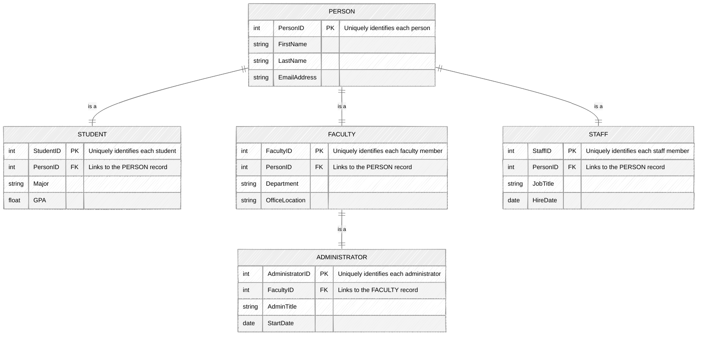
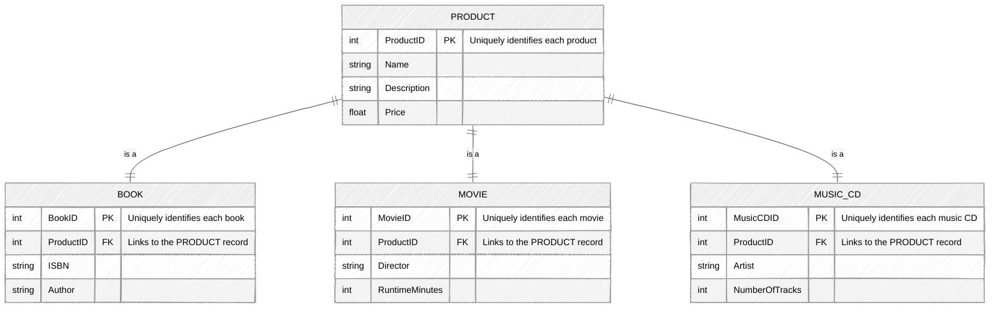
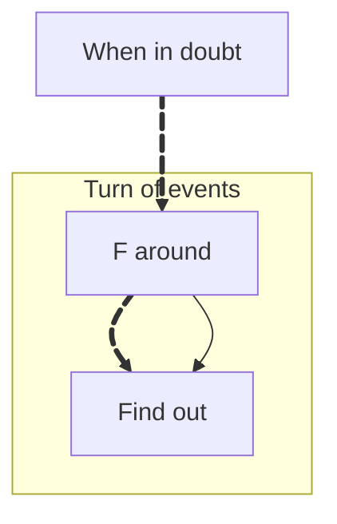
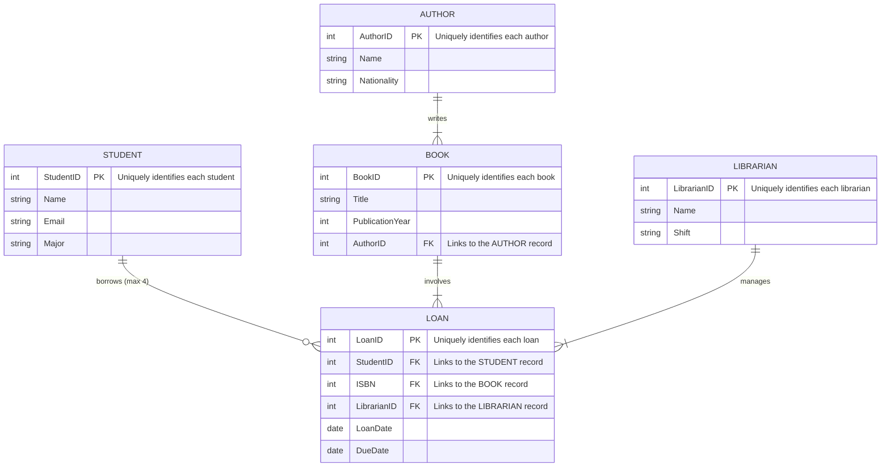
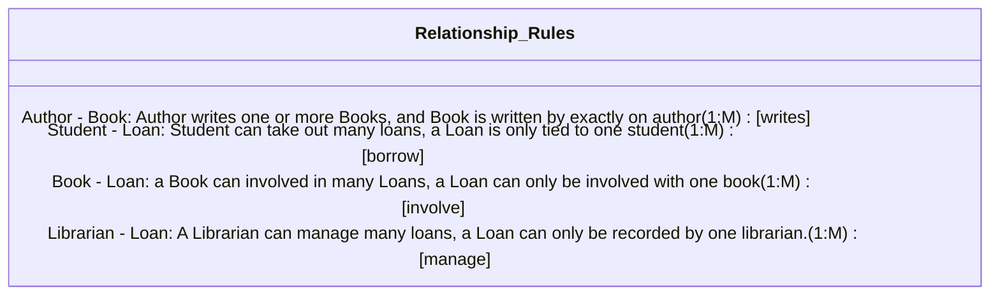

# 
University ERD

```mermaid
---
config:
  look: handDrawn
  theme: neutral
---
erDiagram
    PERSON {
        int PersonID PK "Uniquely identifies each person"
        string FirstName
        string LastName
        string EmailAddress
    }
    STUDENT {
        int StudentID PK "Uniquely identifies each student"
        int PersonID FK "Links to the PERSON record"
        string Major
        float GPA
    }
    FACULTY {
        int FacultyID PK "Uniquely identifies each faculty member"
        int PersonID FK "Links to the PERSON record"
        string Department
        string OfficeLocation
    }
    STAFF {
        int StaffID PK "Uniquely identifies each staff member"
        int PersonID FK "Links to the PERSON record"
        string JobTitle
        date HireDate
    }
    ADMINISTRATOR {
        int AdministratorID PK "Uniquely identifies each administrator"
        int FacultyID FK "Links to the FACULTY record"
        string AdminTitle
        date StartDate
    }

    %% relationship designators
    PERSON ||--|| STUDENT : "is a"
    PERSON ||--|| FACULTY : "is a"
    PERSON ||--|| STAFF : "is a"
    FACULTY ||--|| ADMINISTRATOR : "is a"
```
# 
# 
# 
Online Retail Store ERD

```mermaid
---
config:
  look: handDrawn
  theme: neutral
---
erDiagram
    PRODUCT {
        int ProductID PK "Uniquely identifies each product"
        string Name
        string Description
        float Price
    }
    BOOK {
        int BookID PK "Uniquely identifies each book"
        int ProductID FK "Links to the PRODUCT record"
        string ISBN
        string Author
    }
    MOVIE {
        int MovieID PK "Uniquely identifies each movie"
        int ProductID FK "Links to the PRODUCT record"
        string Director
        int RuntimeMinutes
    }
    MUSIC_CD {
        int MusicCDID PK "Uniquely identifies each music CD"
        int ProductID FK "Links to the PRODUCT record"
        string Artist
        int NumberOfTracks
    }

    %% relationship designators
    PRODUCT ||--|| BOOK : "is a"
    PRODUCT ||--|| MOVIE : "is a"
    PRODUCT ||--|| MUSIC_CD : "is a"
```

```mermaid
---
config:
  theme: default
---
flowchart TD

  A["When in doubt"] e2@==> B
  B["F around"] e1@==> C["Find out"]
  subgraph Turn of events
  B-->C
  end
  e1@{ animate: true }
  e2@{ animate: true }
```

#
#
#
# 
School Library Database

```mermaid

erDiagram
    STUDENT {
        int StudentID PK "Uniquely identifies each student"
        string Name
        string Email
        string Major
    }
    BOOK {
        int BookID PK "Uniquely identifies each book"
        string Title
        int PublicationYear
        int AuthorID FK "Links to the AUTHOR record"
    }
    AUTHOR {
        int AuthorID PK "Uniquely identifies each author"
        string Name
        string Nationality
    }
    LOAN {
        int LoanID PK "Uniquely identifies each loan"
        int StudentID FK "Links to the STUDENT record"
        int ISBN FK "Links to the BOOK record"
        int LibrarianID FK "Links to the LIBRARIAN record"
        date LoanDate
        date DueDate
    }
    LIBRARIAN {
        int LibrarianID PK "Uniquely identifies each librarian"
        string Name
        string Shift
    }

    AUTHOR ||--|{ BOOK : "writes"
    STUDENT ||--o{ LOAN : "borrows (max 4)"
    BOOK ||--|{ LOAN : "involves"
    LIBRARIAN ||--|{ LOAN : "manages"
```

```mermaid
classDiagram
class Relationship_Rules {
    Author - Book: Author writes one or more Books, and Book is written by exactly on author (1:M) [writes]
    Student - Loan: Student can take out many loans, a Loan is only tied to one student (1:M) [borrow]
    Book - Loan: a Book can involved in many Loans, a Loan can only be involved with one book (1:M) [involve]
    Librarian - Loan: A Librarian can manage many loans, a Loan can only be recorded by one librarian. (1:M) [manage]}
```