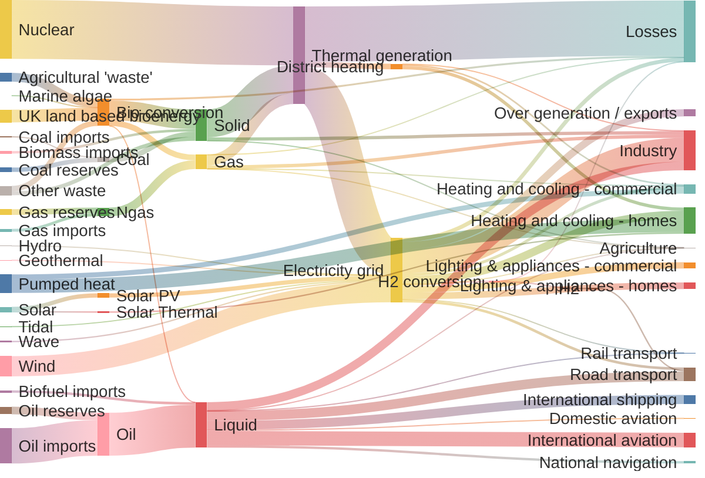
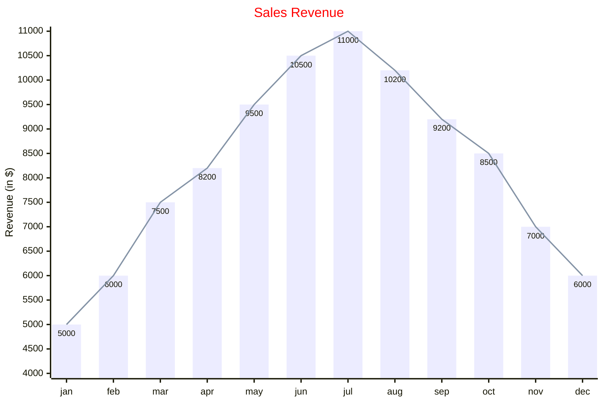
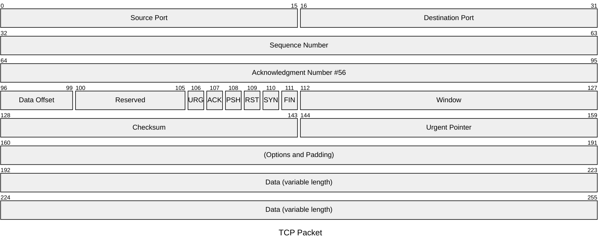
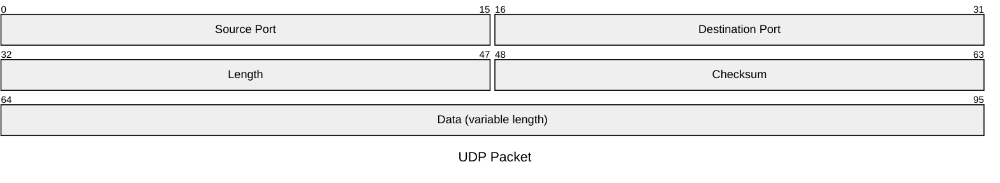
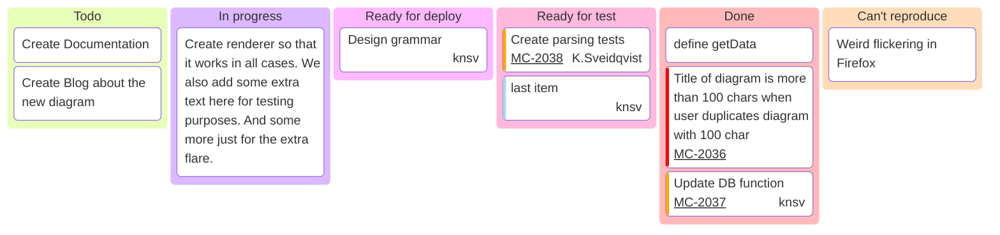
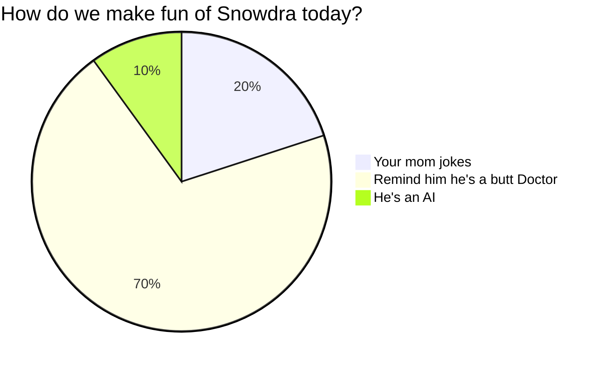
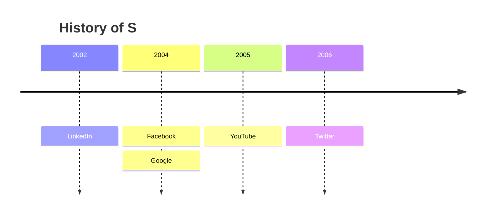
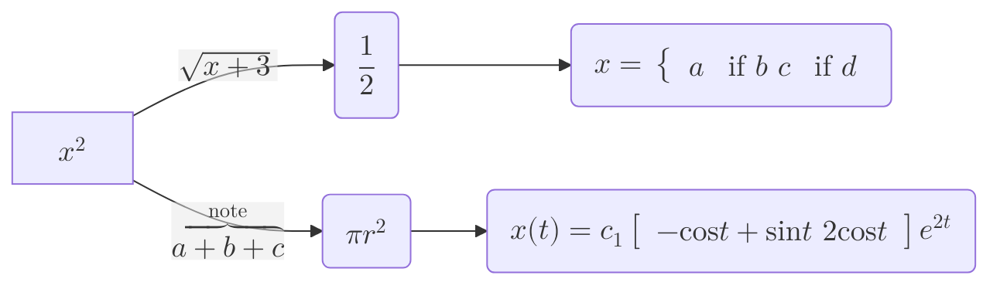

<table style="width:100%; border: none; border-collapse: collapse;">
<tbody>
<tr>
<!-- Column 1: The Information Table -->
<td style="width: 60%; vertical-align: top; padding-right: 20px;">
<table style="width:100%; border-collapse: collapse;">
    <tr style="background-color:#D3E3FD; color:#333;">
      <th style="padding: 8px; border: 1px solid #ccc; text-align: left;">Entity 1</th>
      <th style="padding: 8px; border: 1px solid #ccc; text-align: center;">Cardinality</th>
      <th style="padding: 8px; border: 1px solid #ccc; text-align: left;">Relationship</th>
      <th style="padding: 8px; border: 1px solid #ccc; text-align: left;">Entity 2</th>
      <th style="padding: 8px; border: 1px solid #ccc; text-align: center;">Cardinality</th>
    </tr>
    <tr style="background-color:#FFFFFF;">
      <td style="padding: 8px; border: 1px solid #ccc;">Author</td>
      <td style="padding: 8px; border: 1px solid #ccc; text-align: center;">1</td>
      <td style="padding: 8px; border: 1px solid #ccc;">writes</td>
      <td style="padding: 8px; border: 1px solid #ccc;">Book</td>
      <td style="padding: 8px; border: 1px solid #ccc; text-align: center;">M</td>
    </tr>
    <tr style="background-color:#F2F2F2;">
      <td style="padding: 8px; border: 1px solid #ccc;">Student</td>
      <td style="padding: 8px; border: 1px solid #ccc; text-align: center;">1</td>
      <td style="padding: 8px; border: 1px solid #ccc;">borrows</td>
      <td style="padding: 8px; border: 1px solid #ccc;">Loan</td>
      <td style="padding: 8px; border: 1px solid #ccc; text-align: center;">0..4</td>
    </tr>
    <tr style="background-color:#FFFFFF;">
      <td style="padding: 8px; border: 1px solid #ccc;">Book</td>
      <td style="padding: 8px; border: 1px solid #ccc; text-align: center;">1</td>
      <td style="padding: 8px; border: 1px solid #ccc;">involves</td>
      <td style="padding: 8px; border: 1px solid #ccc;">Loan</td>
      <td style="padding: 8px; border: 1px solid #ccc; text-align: center;">M</td>
    </tr>
    <tr style="background-color:#F2F2F2;">
      <td style="padding: 8px; border: 1px solid #ccc;">Librarian</td>
      <td style="padding: 8px; border: 1px solid #ccc; text-align: center;">1</td>
      <td style="padding: 8px; border: 1px solid #ccc;">manages</td>
      <td style="padding: 8px; border: 1px solid #ccc;">Loan</td>
      <td style="padding: 8px; border: 1px solid #ccc; text-align: center;">M</td>
    </tr>
  </table>

</td>
<!-- Column 2: The Text Block -->
<td style="width: 40%; vertical-align: top;">
  <h3>Analysis of System Relationships</h3>
  
The table on the left outlines the core business rules for the library management system. These relationships, known as cardinalities, define how entities interact with one another.

  
  
For instance, the <strong>one-to-many (1:M)</strong> relationship between an <code>Author</code> and a <code>Book</code> is a foundational concept. It ensures that every book in the database can be traced back to a single author, while allowing each author to be credited for multiple works.

  
A key business rule is enforced on the <code>Student</code> to <code>Loan</code> relationship, where a student is limited to a maximum of four concurrent loans.

</td>
</tr>
</tbody>
</table>

